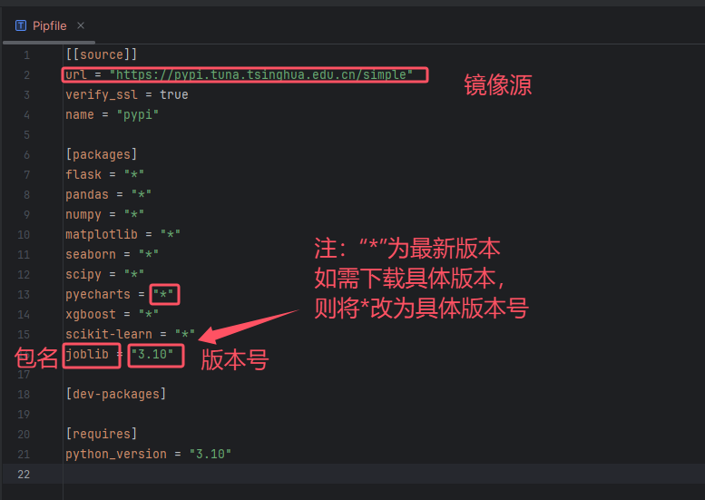
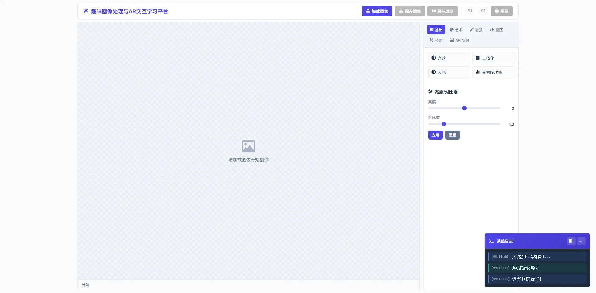
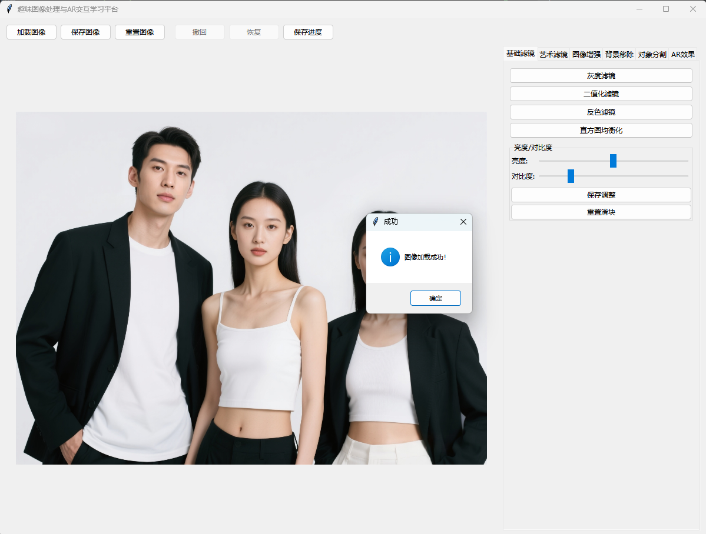

### 1、项目简介
&emsp;&emsp;“趣味图像处理与AR交互学习平台”是一个面向图像处理与计算机视觉学习者的实践型学习系统，通过“技术实操 + 趣味效果”的形式将核心知识点转化为可交互的应用功能，帮助用户在动手实践中掌握图像处理与AR交互技术。系统以“图像处理 + AR 特效”为双主线，每个功能模块对应一组技术知识点，用户通过操作滤镜、分割、虚拟装饰等功能体验技术原理，实现从基础概念到综合应用的学习路径。

### 2、实现流程


### 3、技术要求

#### 3.1 开发语言
Python 3.8+，提供高效的编程环境和丰富的第三方库支持。

### 3.2 Python核心依赖发库
（1）OpenCV：第三方库，提供图像处理与计算机视觉的核心算法支持。<br>
（2）NumPy：第三方库，用于数值计算和数组操作，是OpenCV的基础依赖。<br>
（3）Pillow：第三方库，用于图像格式转换和显示，支持多种图像操作。<br>
（4）MediaPipe：第三方库，提供人脸关键点检测、姿态估计等深度学习相关功能。<br>
（5）pyzbar：第三方库，用于二维码检测与解码。<br>
（6）tkinter：内置库，构建整个应用的图形界面，包括窗口、按钮、滑块、标签页等交互组件。<br>
（7）os：内置库，提供操作系统相关功能（文件 / 目录操作、路径处理）。

### 4、开发环境
#### 4.1 开发环境要求
| 软件名称          | 要求        |
|---------------|-----------|
| Windows操作系统   | Win10以上   |
| Pycharm集成开发环境 | 2020及以上版本 |
| Python解释器     | 3.8及以上版本  |

#### 4.4 包管理配置
&emsp;&emsp;环境变量配置完成后， 在终端运行 pip install pipenv 下载pipenv(如果有pipenv则无需下载) ，然后运行 pipenv install 命令,系统会自动生成一个虚拟环境，一个Pipfile文件以及一个 Pipfile.lock 文件。同时系统会自动下载Pipfile文件中的包，将现有环境更换为虚拟环境后可以直接使用。如果开发时需要使用新的包，则需先将要使用的包添加至Pipfile文件，后使用pip update 命令更新。

pipfile文件说明：



### 5、目录结构
```
photo_editor/                      # 项目根目录
├── main.py                        # 【主程序文件】
│                                  # 程序入口点，包含：
│                                  # - 主窗口 GUI (Tkinter)
│                                  # - 用户交互逻辑 (按钮、菜单)
│                                  # - 图像显示逻辑
│                                  # - 历史记录管理 (Undo/Redo)
│                                  # - 协调调用各个功能模块
│
├── filters/                       # 【文件夹】基础图像滤镜模块
│   ├── basic_filters.py           # 基础滤镜操作
│   │                              # - 灰度化 (grayscale)
│   │                              # - 二值化 (binary)
│   │                              # - 反色 (invert)
│   │                              # - 亮度/对比度调整 (brightness_contrast)
│   │                              # - 直方图均衡化 (histogram_equalization)
│   │
│   ├── artistic_filters.py        # 艺术化滤镜
│   │                              # - 线描滤镜 (edge_detection) 
│   │                              # - 素描滤镜 (sketch_filter)
│   │                              # - 卡通滤镜 (cartoon_filter)
│   │                              # - 油画滤镜 (oil_painting)
│   │
│   └── enhancement.py             # 图像增强技术
│                                  # - 高斯模糊 (gaussian_blur)
│                                  # - 中值滤波 (median_blur)
│                                  # - 双边滤波 (bilateral_filter)
│                                  # - 锐化 (sharpen)
│
├── segmentation/                  # 【文件夹】图像分割模块
│   ├── background_removal.py      # 背景移除相关功能
│   │                              # - 绿幕抠图 (green_screen_removal)
│   │                              # - 肤色分割 (skin_segmentation)
│   │                              # - 背景替换 (replace_background)
│   │                              # - 管理背景图片库
│   │
│   └── object_segmentation.py     # 对象分割算法
│                                  # - Canny边缘分割 (canny_edge_segmentation)
│                                  # - 分水岭算法 (watershed_segmentation)
│                                  # - 连通域分析 (connected_components)
│
├── ar_effects/                    # 【文件夹】增强现实 (AR) 效果模块
│   ├── face_detection.py          # 基于 Haar 级联的 AR 效果
│   │                              # - 人脸检测 (detect_faces)
│   │                              # - 虚拟帽子 (add_virtual_hat)
│   │
│   ├── pose_estimation.py         # 基于 MediaPipe 的 AR 效果
│   │                              # - 姿态估计/面部网格 (estimate_pose)
│   │                              # - 墨镜特效 (add_sunglasses)
│   │                              # - 鼻环装饰 (add_nose_ring)
│   │
│   └── qr_sticker.py              # 基于 pyzbar 的 AR 效果
│                                  # - 二维码检测与解码 (detect_qr_codes)
│                                  # - 二维码贴纸 (add_sticker_on_qr)
│
└── assets/                        # 【文件夹】项目资源文件
    ├── images/                    # 图像处理示例操作图像
    │
    ├── stickers/                  # AR 贴纸素材
    │   ├── hat.png                # 虚拟帽子图片
    │   ├── sunglasses.png         # 墨镜图片
    │   └── star.png               # 二维码贴纸
    │
    └── backgrounds/               # 背景替换素材

```

### 6、 运行方法
&emsp;&emsp;运行main.py文件后进入趣味图像处理与AR交互学习平台。


### 7、项目总览
&emsp;&emsp;进入项目后加载图像，开始后续学习。


